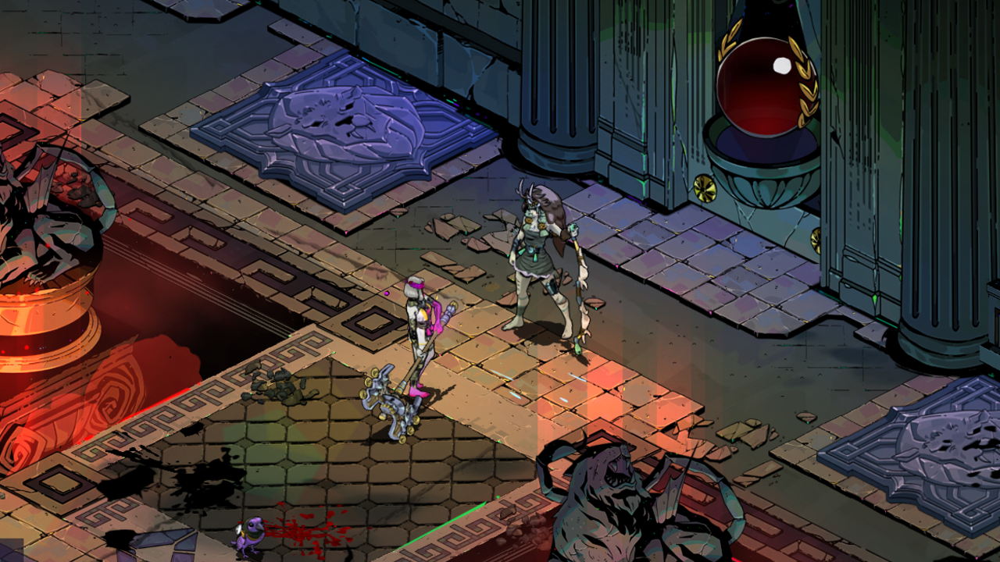
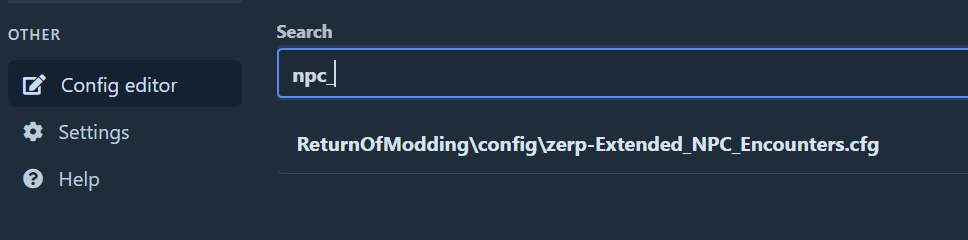
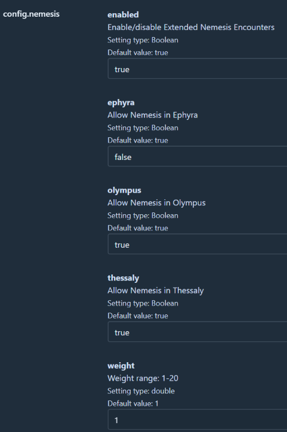

## Extended NPC Encounters

Adds NPC encounters to regions that they cannot normally appear in. Also allows Thanatos to appear in some H2 biomes if Zagreus' Journey is installed.

  
  

  
  

  
  

## Installation

Use r2modman by ebkr from [Thunderstore](https://thunderstore.io/package/ebkr/r2modman/) or [GitHub](https://github.com/ebkr/r2modmanPlus/releases/latest).

While the mod has been tested decently well, there can still be some scenarios which didn't show up in testing that softlock the game. It is recommended to backup your save from `%USERPROFILE%\Saved Games\Hades II\Profile*.sav` before modding in case there are issues.

It is recommended not to uninstall the mod or load the game un-modded while in the middle of a modded run.

## Configuration

Mod can be configured through the r2modman config editor. Requires the game to be run atleast once with the mod installed for the default config to be generated.

    

 

Each new encounter added can disabled/enabled as you see fit. Each NPC can have their chance of showing up in non-vanilla regions configured by setting the `weight` value.

    

## Issues and feedback

Report any issues or feedback [here](https://github.com/adi1998/ExtendedNPCEncounters/issues) or on the [Hades Modding Discord](https://discord.gg/bKvJTAJj)
